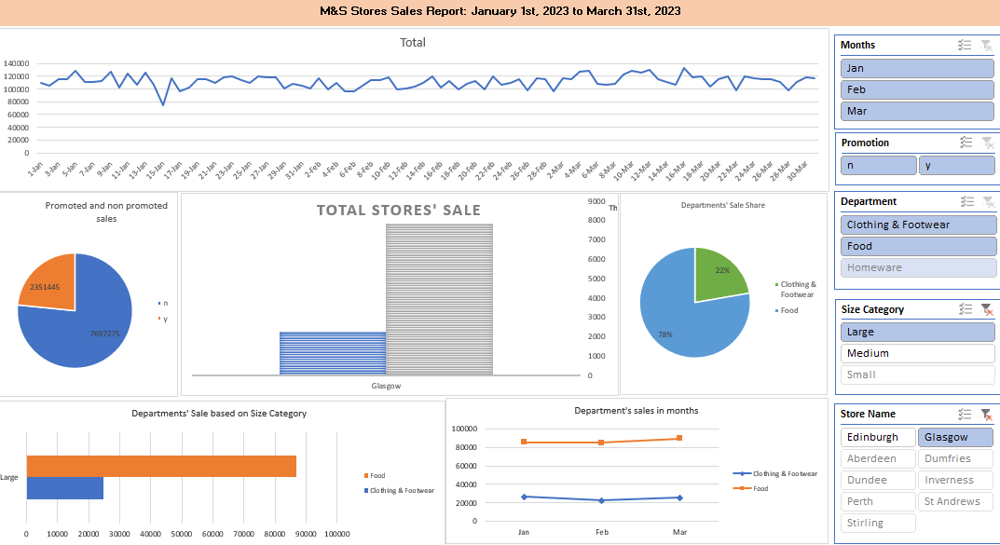

# Sales Data Analysis for Marks & Spencer (M&S)

## Overview

This project demonstrates how data analytics can help **Marks & Spencer** better understand their sales data and facilitate informed decision-making at the regional level. The analysis covers sales data for nine M&S stores in Scotland from **01/01/21 to 31/03/21**, divided by departments: **Food**, **Homeware**, and **Clothing & Footwear**. Additional data, including store size, promotional activities, and transportation costs, was integrated to perform a comprehensive business analysis.

The project involves the following key components:
- **Data Cleaning and Validation**
- **Excel Dashboard Creation**
- **Monte Carlo Simulation** for profitability risk analysis
- **Optimisation** of food distribution costs

## Main Project
The main Excel file containing the interactive dashboard, data analysis, Monte Carlo simulation, and optimisation model for Marks & Spencer sales performance analysis can be seen here: [M_and_S_Sales_Analysis.xlsx](M_and_S_Sales_Analysis.xlsx).

## Problem Statement

The main objectives of this analysis are to:
1. Inspect and clean the provided dataset and assess the validity of the sales data.
2. Develop an Excel-based dashboard to summarise the data and allow for detailed data enquiries.
3. Use Monte Carlo simulation to assess profitability risks in the **Aberdeen Homeware Department**.
4. Apply optimisation techniques to minimise transportation costs from the M&S northern distribution centres to individual stores.

## Key Components

### 1. Data Cleaning and Integration
- **Approach**: Integrated two datasets—one containing store codes, store sizes, and transport costs, and the other containing sales data. Cleaned the data for missing or inconsistent entries and prepared it for analysis.
- **Outcome**: The dataset was validated and prepared for further analytics functions.

### 2. Excel Dashboard
- **Approach**: Created an interactive Excel dashboard to allow the regional directors to easily visualise key trends and perform detailed data enquiries. The dashboard includes:
  - **Sales Performance by Department**: Daily sales trends for each store and department.
  - **Promotional Analysis**: Impact of promotions on sales revenue across different departments.
  - **Store Comparisons**: Comparative analysis based on store size and sales performance.
- **Outcome**: The dashboard allows for quick insights into sales trends and helps decision-makers explore detailed sales enquiries.

### 3. Monte Carlo Simulation for Profitability Risk in Aberdeen Homeware
- **Approach**: Utilised Monte Carlo simulation to analyse the risk associated with **Homeware profitability** in Aberdeen. The simulation assumed gross profit margins between **60% to 70%** and a daily overhead contribution of **£4,250**.
- **Outcome**: The simulation provided risk-based insights into profitability levels, using non-promotion sales data to evaluate potential scenarios.

### 4. Optimisation of Food Distribution Costs
- **Approach**: Applied optimisation techniques to minimise food distribution costs from northern distribution centres. The optimisation ensured that distribution centres can deliver, at minimum, the equivalent of maximum non-promotion day sales to each store.
- **Outcome**: The optimised process identified cost-saving opportunities in the food transportation system, leading to improved logistics efficiency.

## Data Sources

The project used two Excel datasets:
1. **Store Data**: This dataset includes store codes, department sizes, and daily food distribution costs.
2. **Sales Data**: Daily sales data for each department (**Food**, **Homeware**, and **Clothing & Footwear**) across nine M&S stores in Scotland, including promotional activity information.

## Ethical Considerations
- **Data Privacy**: No personal or sensitive customer information was used. All data is anonymised and focused solely on store performance and logistics.
- **Impact of Analysis**: This analysis provides decision-makers with actionable insights that can improve operational efficiency and profitability across M&S’s Scottish stores.

## Conclusion

This project demonstrates the value of business analytics for **Marks & Spencer**, providing valuable insights into sales performance, profitability, and logistics. By integrating multiple datasets and using advanced analytical techniques such as Monte Carlo simulation and optimisation, the project highlights areas for cost savings and improved decision-making.

---

## Files in the Repository:
- **`M_and_S_Sales_Analysis.xlsx`**: The main Excel file.
- **`datasets/`**: This folder contains the original data files used for the analysis:
  - **`Store_Data.xlsx`**: Contains store codes, store sizes, and transportation costs.
  - **`Sales_Data.xlsx`**: Contains sales data for each department (Food, Homeware, and Clothing & Footwear) across nine M&S stores in Scotland.
- **`images/`**: This folder contains images related to the project:
  - **`dashboard_view.png`**: A visual overview of the dashboard created for the project.

